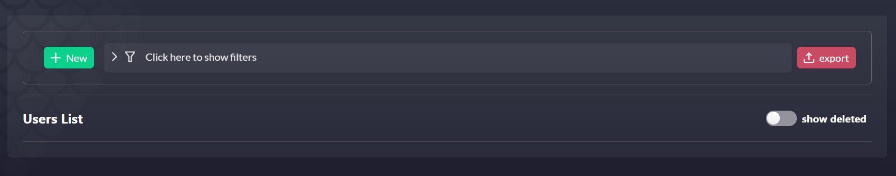
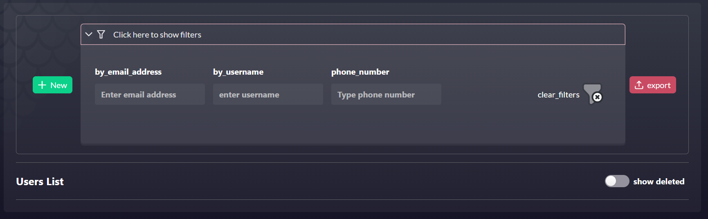

# FormKit-builder 

## Table of Contents
1. [Introduction](#introduction)
3. [Installation](#installation)
4. [Usage](#usage)
5. [data-create-form Component](#data-create-form)
6. [data-update-form Component](#data-update-form) 
7. [data-filter-form Component](#data-filter-form) 


## Introduction 
Introducing Formkit Builder, a Vue 3 package designed to streamline your form management. This package serves as a comprehensive wrapper for Formkit forms, enhancing your form experience with features such as seamless loading handling, superior error management, handle toast notifications appearance and efficient API calls. By just passing a sections object, a submit handler, and form options, you can effortlessly create ready-to-use forms. 

This package significantly leverages the capabilities of the Formkit library. A thorough understanding of the Formkit library will enable you to utilize the Formkit Builder package to its full potential. For a comprehensive guide on Formkit, we recommend referring to the Formkit library's documentation [Formkit library's documentation](https://formkit.com/getting-started/what-is-formkit). Familiarize yourself with Formkit to optimize your use of the Formkit Builder package.


## Installation: 
To install Formkit Builder, use the following command in your terminal: `npm i formkit-builder`. This will add the package to your project, equipping it with the advanced form management capabilities that Formkit Builder provides.

## Usage
The package comprises two key components: `data-create-form` and `data-update-form`. 

The `data-create-form` component is equipped with a range of props, which when used correctly, can help generate a form with multiple features. 

## data-create-form

**Props**

### Sections Prop

- **sections (Required, Array)**: This prop accepts an array of `FormKitSection` objects. Each object should include formkit properties like `$formkit`, `outerClass`, `name`, `label`, `placeholder`, `validation`. and a section title as a key for each sections object Here's an example:
```
[
  {
    "Form Title": [
      {
        $formkit: 'text',
        outerClass: "col-4",
        name: 'roleName',
        label: t('roleNameLabel'),
        placeholder: t('roleNamePlaceholder'),
        validation: 'required|length:3',
      },
    ]
  }
]
```

### Options Prop

- **options (Required,Object : FormKitOptions)** : This props accepts an object of type `FormKitOptions` which should include `title` , `allowBulkDelete` and `showHeaderSubmit` properties. Here's the implementation of the `FormKitOptions` type : 

```
export interface FormKitOptions {
    title: string;
    allowBulkDelete?: boolean;
    showHeaderSubmit?: boolean;
}
```

`title` property is a string that represents the form title that will appear in the form header at the top of the page .. `allowBulkDelete` property is a boolean that determine if the form will include a bulk create switch button or not .. `showHeaderSubmit` property is a boolean that determines if the header submit button will appear or not , it's an optional property so if we didn't provide it a post form submit button only will appear. Here's an example : 

```
const options: FormKitOptions = {
  title: "role_create",
  allowBulkDelete: false,
}

```

### SubmitHandler Prop


- **submitHandler (Required, Object)**: This required prop is crucial for managing the function that executes post form submission. The object should match the `FormSubmitHandler` type which comprise the following properties:

```
export interface FormSubmitHandler<Req, TargetRequest, Res> {
    submit: (req: TargetRequest) => Promise<Res>;
    submitCallBack?: (response: Res) => any;
    indentifierPropertyName?: string;
    errorHandler: Record<string, FormKitError>
    mapFunction?: (req: Req) => TargetRequest;
    redirectRoute?: string; // Modify the type to match your redirect route
}

```

  - **submit (Required,function)**: This property signifies the API endpoint function used for dispatching the form data. for example :
  
```
submit: apiClient.roleCreate

```

  - **submitCallBack (Optional,function)**: This optional property signifies an optional function that can be employed post the submit function (API) to manipulate the response or execute some logic. Here's an example : 

``` 
 submitCallBack: (res: any) => {
    router.push({ name: "list" })
},
```
  - **errorHandler (Required,Object)**: This property is responsible for mapping error keys to error messages, thereby facilitating the display of the appropriate error message on the respective input field. Here's an example:
```
{
  'unique_constraint_roles_role_name_key': {
    "Input name": 'unique_constraint_roles_role_name_key'
  }
}
```
  -**mapFunction (Optional,Function)**: This optional function allows for manipulation of the request that we got from the form data , enabling the reformatting of the request to align with specific requirements before executing the submit function so we can use the manipulated request in the submit funcion.

  example for submitHandler prop : 

  ```
  const submitHandler: FormSubmitHandler<RoleCreateRequest, RoleCreateRequest, RoleCreateResponse> = {
  submit: apiClient.roleCreateWithErr,
  submitCallBack: (res: any) => {
    router.push({ name: "list" })
  },
  errorHandler : {
    'unique_constraint_roles_role_name_key': {
      roleName: 'unique_constraint_roles_role_name_key'
    }
  }
}
  ```

### toastHandler Prop

- **toastHandler (Optional, Function)**: A function to handle toast notifications appearance. If not provided, a default handler will be used. Here's an example : 
```
const toastHandler: FormKitToastHandler = {
  hideToast: false , 
  title : 'purchase done!',
  message : 'You have completed the purchase sucssefully'
}
```


## data-update-form

The `data-update-form` component shares the same props structure as the `data-create-form` component, with the addition of a unique, required prop: `findDataHandler`.


- **findDataHandler (Required, Object)** : This prop is only present in the `data-update-form` component, and is responsible for populating the form with specific data in the update page. It contains:

    - **findData (Function)**: This function retrieves the data that the form will be filled according to.

    - **findRequestPropertyName (String)**: This string defines the unique property that the data retrieval will be based on.

    - **mapFunction (Function)**: This optional function allows for manipulation of the response returned from the `findData` function, enabling the reformatting of the response to align with specific requirements.

for example : 

```
const findDataHandler: FormFindDataHandler<RoleFindRequest, RoleFindResponse, any> = {
  findData: apiClient.roleFind,
  findRequerPropertyName: 'roleId',
}

```

## Full example for using the data-create-form

```
<script setup lang="ts">
import { FormKitOptions, FormSubmitHandler } from 'formkit-builder/types'
import {RoleCreateRequest, RoleCreateResponse} from '@models/v1/user/role_definitions_pb'
import apiClient from '@/common/api/ApiClient';
import type { FormKitSection, FormKitError } from 'formkit-builder/types'
import permissions from '@/assets/permissions'
const options: FormKitOptions = {
    title: "role_create",
    allowBulkDelete: true,
    showHeaderSubmit : true
}
const sections: FormKitSection[] = [
    {
        roleInfo: [
            {
                $formkit: 'text',
                outerClass: "col-4",
                name: 'roleName',
                label: 'roleNameLabel',
                placeholder: 'roleNamePlaceholder',
                validation: 'required|length:3',
            },
            {
                $formkit: 'textarea',
                outerClass: "col-8",
                name: 'roleDescription',
                label: 'roleDescriptionLabel',
                placeholder: 'roleDescriptionPlaceholder',
                validation: '',
            },
        ],
    },
    {
        permissions: [
            {
                $cmp: 'FormKit',
                props: {
                    outerClass: "w-full",
                    type: 'permissions',
                    name: 'permissions',
                    permissions: permissions
                }
            }
        ],
    }
]

const errorHandler: Record<string, FormKitError> = {
    'unique_constraint_roles_role_name_key': {
        roleName: t('unique_constraint_roles_role_name_key')
    }
}


const redirectRoute: string = 'roles_list'

const submitHandler: FormSubmitHandler<RoleCreateRequest, RoleCreateRequest, RoleCreateResponse> = {
    submit: apiClient.roleCreate,
    errorHandler,
    redirectRoute,
}
</script>

<template>
    <data-create-form :sections="sections" :submitHandler="submitHandler" :options="options" />
</template>
```


## Full example for using the data-update-form

```
<script setup lang="ts">
import type { FormKitSection, FormKitError, FormKitToastHandler, FormKitOptions, FormSubmitHandler, FormFindDataHandler } from '@/types'
import type { RoleUpdateRequest, RoleUpdateResponse, RoleFindRequest, RoleFindResponse } from '@/api/ApiTypes';
import apiClient from '@/api/ApiMock';
import { useI18n } from 'vue-i18n';

const { t } = useI18n()
const errorHandler: Record<string, FormKitError> = {
  'unique_constraint_roles_role_name_key': {
    roleName: 'unique_constraint_roles_role_name_key'
  }
}
const redirectRoute: string = 'list'
const sections: FormKitSection[] = [
    {
        roleInfo: [
            {
                $formkit: 'text',
                outerClass: "col-4",
                name: 'roleName',
                label: 'roleNameLabel',
                placeholder: 'roleNamePlaceholder',
                validation: 'required|length:3',
            },
            {
                $formkit: 'textarea',
                outerClass: "col-8",
                name: 'roleDescription',
                label: 'roleDescriptionLabel',
                placeholder: 'roleDescriptionPlaceholder',
                validation: '',
            },
        ],
    },
    {
        permissions: [
            {
                $cmp: 'FormKit',
                props: {
                    outerClass: "w-full",
                    type: 'permissions',
                    name: 'permissions',
                    permissions: permissions
                }
            }
        ],
    }
]
const options: FormKitOptions = {
  title: "role_update",
  allowBulkDelete: false,
}

const submitHandler: FormSubmitHandler<RoleUpdateRequest, RoleUpdateRequest, RoleUpdateResponse> = {
  submit: apiClient.roleUpdate,
  errorHandler,
  redirectRoute,
}
const findDataHandler: FormFindDataHandler<RoleFindRequest, RoleFindResponse, any> = {
  findData: apiClient.roleFind,
  findRequerPropertyName: 'roleId',
}

</script>

<template>
  <data-update-form :sections="sections" :findDataHandler="findDataHandler"
    :submitHandler="submitHandler" :options="options" />
</template>
```


## data-filter-form

The `data-filter-form` is a key component of our package that significantly enhances user experience by automating the generation of a filtering form. This is achieved based on the inputs passed as props to the component. One of the standout features of `data-filter-form` is its ability to handle live filtering through the use of events. This makes it an essential tool for efficiently creating and managing your filter form. Therefore, a proficient understanding of how to use props and listen to events is highly beneficial when utilizing this component.

**props**

**inputs(required, array : FormKitInput)** : this required prop is the only props that `data-filter-form` component provide and it accepts an  array of type `FormKitInput` which represents the array of inputs that the filter form will contain 

example : 

```
const inputs: Array<FormKitInput | FormKitComponent> = [
  {
    $formkit: 'text',
    outerClass: "col-3",
    name: 'userEmail',
    label: 'by_email_address',
    placeholder: 'Enter email address',
  },
  {
    $formkit: 'text',
    outerClass: "col-3",
    name: 'userName',
    label: 'by_username',
    placeholder: 'enter username',
  },

  {
    $formkit: 'text',
    outerClass: "col-3",
    name: 'UserPhone',
    label: 'phone_number',
    placeholder: 'Type phone number',
  },
]
```

output : 




### events

**@filter**

A noteworthy event is `@filter`. This event is designed to send a filterObject, which includes a key symbolizing the name of the filter utilized by the user, as well as a value representing the filter value that the user has applied to sort the data. This allows for a dynamic and user-responsive filtering process, enhancing the overall data management experience.

**@clearFilter**

Yet another event to be mindful of is `@clearFilter`. This event serves to notify you when a user has removed all previously applied filters. By listening for this event, you can take action to revert back and display the original, unfiltered data. This ensures that the data presented is always in line with the user's current filtering preferences, providing a seamless and user-friendly experience.